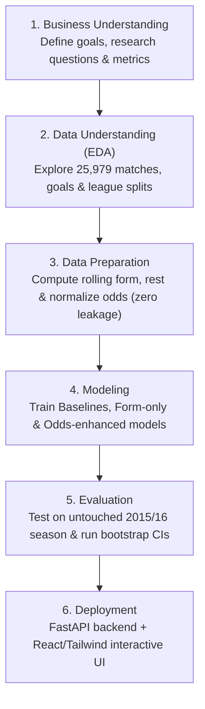

# European Soccer Home Advantage & Outcome Prediction: Comprehensive Project Explanation

## 🎯 1. Introduction & Core Research Question
Imagine stepping up to present this data science project to an audience ranging from soccer fans to senior data scientists. 

The central question we answer is:
> **"How strong is home-field advantage in European soccer, and how accurately can match results be predicted using information available before kickoff?"**

To answer this, we analyzed **25,979 professional matches** from 11 top European leagues across 8 full seasons (2008/09 through 2015/16) using the **CRISP-DM** (Cross-Industry Standard Process for Data Mining) methodology.

---

## 🧭 2. The CRISP-DM Lifecycle Explained Simply

CRISP-DM breaks data mining projects into 6 structured phases:

1. **Business Understanding**: Rather than chasing arbitrary accuracy numbers, we define a principled objective: understand home pitch advantage and test whether statistical team form can add predictive value over the multi-billion-dollar sports betting market.
2. **Data Understanding (EDA - Exploratory Data Analysis)**:
   - **What EDA stands for:** **E**xploratory **D**ata **A**nalysis.
   - **What it is:** The foundational step where data scientists visually explore and summarize the raw dataset to uncover patterns, spot anomalies, and verify hypotheses before building predictive models.
   - **What the EDA tab answers in our UI:** It answers the first half of the research question (*"How strong is home advantage?"*):
     - **League Win Rates:** Home teams win ~46% of matches across top European leagues (e.g., La Liga, Premier League).
     - **Season Stability:** Shows that home dominance is persistent and steady across all 8 seasons (~+0.38 goals per game).
     - **Goal Distributions:** Demonstrates host teams score 1.54 goals/game vs 1.16 for visiting clubs.
3. **Data Preparation**: We engineer rolling 5-game moving averages of points, goal differentials, and rest days. We enforce a strict rule: **zero information from future matches or same-day fixtures may enter a match's feature vector**.
4. **Modeling**: We train 4 tiers of models: Majority Baseline, Market Odds Baseline, Form-Only Models, and Odds-Enhanced Models.
5. **Evaluation**: We evaluate all models on the untouched **2015/16 test season** (2,905 matches with complete odds) using Macro-F1, Accuracy, Log Loss, Brier Score, and Calibration curves.
6. **Deployment**: We package the solution into a modern full-stack web application with live interactive simulation capabilities.

---

## 🔒 3. Preventing Data Leakage & Temporal Splitting

### What is Data Leakage?
* **Definition:** Data leakage happens when a machine learning model accidentally gets access to information during training that it **would not have in the real world** at the moment of prediction.
* **Real-World Analogy:** Giving a student the exam answer key the night before the test. They will score 100% on the practice test, but fail when given a real exam with new questions.
* **In Sports Analytics:** If your model uses stats from *after* a match was played (e.g., end-of-season standings, future transfers, or later scores) to predict an earlier match, the model "cheats" and appears deceptively accurate.

### Why Random Splitting Causes Catastrophic Leakage
In traditional machine learning, practitioners often use random train/test splits (e.g., `train_test_split(test_size=0.2)`). **In sports analytics, doing this is fatal!**
- If you randomly shuffle soccer matches, a model might train on a fixture from **May 2015**, and use that future knowledge to predict a match from **September 2014**.
- Future team momentum and roster strength "leak" backward into historical predictions.

### Our Leakage Prevention Protocol
1. **Strict Temporal Partitioning**:
   - **Training Set (2008/09 – 2013/14)**: The model only learns from earlier history (19,328 matches).
   - **Validation Set (2014/15)**: Used strictly for hyperparameter tuning.
   - **Untouched Test Set (2015/16)**: Kept in a digital vault (2,905 fixtures) and evaluated exactly once.
   - *Result:* The model only ever predicts forward in time, exactly like a real analyst sitting in the stadium prior to kickoff.

2. **Same-Day Batch Processing Protocol**:
   - **The Problem:** In soccer, 6 to 10 matches often kick off simultaneously on a Saturday afternoon (e.g., at 3:00 PM).
   - **The Risk:** If you update Team A's historical record immediately at 3:01 PM when their game ends, while Team B's match is ongoing or in the same window, Team A's new results could accidentally contaminate other calculations on that calendar date.
   - **The Solution:** All fixtures scheduled on a given calendar date are predicted simultaneously using only historical data prior to that date. Once all predictions for that date are completed, team rolling states are updated before advancing to the next day.

---

## ⚖️ 4. The "Accuracy vs. Macro-F1" Tradeoff: Understanding the Draw Dilemma

One of the most profound insights of this research is the difference between **Raw Accuracy** and **Macro-F1 Score**.

### What is Macro-F1 & Why is it Important?
- **Raw Accuracy:** The total percentage of matches guessed correctly.  
  *Why Accuracy is misleading in 3-way soccer outcomes:* Because Home Wins occur ~46% of the time and Away Wins ~29%, a model can simply predict the betting favorite every time and achieve ~52% accuracy—while **predicting virtually zero draws**.
- **F1-Score:** The harmonic mean of **Precision** (when the model predicts a draw, how often is it right?) and **Recall** (out of all actual draws, how many did the model catch?).
- **Macro-F1:** Calculates the F1-score for **Home Wins ($H$)**, **Draws ($D$)**, and **Away Wins ($A$)** separately, and takes their unweighted average:
  $$\text{Macro-F1} = \frac{F1_H + F1_D + F1_A}{3}$$
- **Why it is critical:** It treats all three outcomes with equal importance and heavily penalizes models that ignore hard-to-predict outcomes like draws.

### The Draw Dilemma & The Scikit-Learn Argmax Phenomenon
- In real-world European soccer:
  - Home Wins occur: ~45.9%
  - Away Wins occur: ~28.7%
  - Draws occur: ~25.4%
- Because a draw is rarely the single highest-probability outcome for any individual match (typically hovering around 24–30% implied probability), standard machine learning classifiers encounter the **Scikit-Learn Argmax Dilemma**:
  - `predict()` chooses the label with the maximum single probability (`argmax(P(H), P(D), P(A))`).
  - Because either the Home Win (e.g. 45%) or Away Win (e.g. 32%) almost always exceeds the Draw probability, **standard discrete classifiers virtually never pick 'Draw' as their #1 choice**.
  - In our test season (733 actual draws), our Odds-Enhanced Logistic Regression model chose Draw only 2 times in discrete classification (`0.27% Draw Recall`, `52.05% Accuracy`, `0.3836 Macro-F1`).
  - The Betting Market Baseline exhibits the exact same behavior (`52.01% Accuracy`, `0.3799 Macro-F1`, 0 draws predicted).

### Why Continuous Calibrated Probabilities Matter:
- In sports analytics, forcing a model into a discrete binary choice ($H, D, A$) hides critical predictive nuance.
- What matters in practice is **probability calibration**: When our model predicts a 28% probability of a draw, does a draw occur roughly 28% of the time?
- Our calibration curve demonstrates strong reliability (ECE = 0.0105 for draws), proving that the model captures meaningful risk signals before kickoff even when standard discrete `argmax` collapses on draws.

---

## 🖥️ 5. Step-by-Step Presentation & Demo Guide

When demonstrating this project to stakeholders or an evaluator, follow this structured flow:

### Step 1: Executive Overview Tab
- Show the headline KPI cards.
- Highlight the **45.87% Home Win dominance** across 25,979 matches.
- Emphasize the locked temporal evaluation on 2015/16.

### Step 2: Home Advantage EDA Tab
- Walk through the **League Breakdown Chart**: Point out that Spain (La Liga) and England (Premier League) show strong home win rates (~46-47%).
- Show the **Season Stability Chart**: Point out that home advantage has remained consistent across all 8 seasons (+0.38 goals/game).
- Inspect the **Team Rankings Table**: Point out that elite clubs (Barcelona, Real Madrid, Bayern Munich) have home win rates exceeding 80%.

### Step 3: Models & Calibration Tab
- Show the **Benchmark Matrix**: Compare Majority Baseline $\rightarrow$ Market Odds $\rightarrow$ Form-Only $\rightarrow$ Odds-Enhanced models.
- Explain the **Scikit-Learn Argmax Dilemma**: Show the Confusion Matrix and explain why discrete classifiers almost never pick Draw as their #1 outcome (Draw Recall = 0.27%, 2 draws caught out of 733).
- Highlight the **Draw Calibration Curve**: Demonstrate that continuous predicted probabilities (ECE = 0.0105 for draws) provide reliable risk signals even when discrete labels collapse.

### Step 4: Match Explorer Tab
- Filter by **Premier League (England)**.
- Filter by **Draws** or **Incorrect predictions** to inspect interesting underdog upsets from the 2015/16 season (such as Leicester City's historic title run).

### Step 5: Live Match Predictor Tab
- Select **Arsenal** vs **Chelsea**.
- Tweak the **Recent Form Sliders** (e.g. give Arsenal 2.5 pts/game and Chelsea 1.0 pt/game).
- Enter hypothetical pre-match betting odds and click **⚡ Simulate Kickoff Prediction**.
- Watch the probability distribution update instantly and read the automated Data Science Tactical Insight!

---

## ⚙️ 6. Backend REST API Architecture (The 3 Core Endpoints)

If you are asked to walk through the FastAPI backend code or explain how the backend works, use this 1-minute breakdown for each core endpoint:

### 🎙️ 1. `/api/eda` (The Home Advantage Explorer)
* **Why it's important:** Before building any machine learning models, we needed to answer our first research question: *Is home-field advantage actually real, and how strong is it across Europe?*
* **How it works behind the scenes:** When we load our raw SQLite database of 26,000 games, this endpoint crunches all the numbers—calculating home win rates (~46%), away win rates, draws, and average goals scored across 11 different leagues and 8 seasons. It bundles all that data into clean JSON and sends it to the frontend.
* **Where you see it in the app:** It powers the **'Home Advantage EDA' tab** (league win rate bars, season stability trendlines, and goal distribution histograms).

### 🎙️ 2. `/api/models` (The Model Scorecard)
* **Why it's important:** This is our evidence endpoint. It proves how our machine learning models perform against baselines on real, unseen games from the 2015/16 test season.
* **How it works behind the scenes:** When our Python backend finishes evaluating our models on the final test season of 2,905 games, it saves a scorecard. This endpoint loads that scorecard and returns the side-by-side comparison matrix, confusion matrix counts, calibration curves, and bootstrap confidence intervals.
* **Where you see it in the app:** It powers the **'Models & Calibration' tab** (comparison matrix table, interactive confusion matrix inspector, and reliability curves).

### 🎙️ 3. `POST /api/predict` (The Live Match Simulator)
* **Why it's important:** A machine learning model isn't useful if it just sits in a notebook. This endpoint brings our model to life by letting anyone simulate any matchup right before kickoff.
* **How it works behind the scenes:** The frontend sends a JSON package with the two teams, their recent 5-game rolling stats (points per game, goal differentials), rest days, and bookmaker odds. The endpoint calculates feature differentials on the fly, loads our saved `lr_odds_enhanced.pkl` model file, runs inference in milliseconds, and sends back calibrated win, draw, and loss probabilities.
* **Where you see it in the app:** It powers the **'Live Match Predictor' tab** (the interactive sliders, odds inputs, live probability gauge, and data science tactical commentary).
