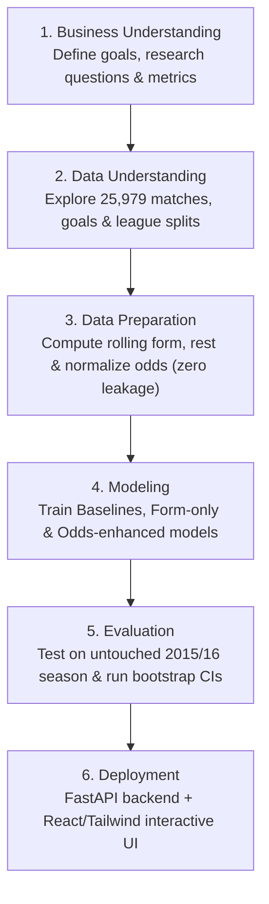

# European Soccer Home Advantage & Outcome Prediction: Comprehensive Project Explanation

## 🎯 1. Introduction & Core Research Question
Imagine stepping up to present this data science project to an audience ranging from soccer fans to senior data scientists. 

The central question we answer is:
> **"How strong is home-field advantage in European soccer, and how accurately can match results be predicted using information available before kickoff?"**

To answer this, we analyzed **25,979 professional matches** from 11 top European leagues across 8 full seasons (2008/09 through 2015/16) using the **CRISP-DM** (Cross-Industry Standard Process for Data Mining) methodology.

---

## 🧭 2. The CRISP-DM Lifecycle Explained Simply

CRISP-DM breaks data mining projects into 6 structured phases:

1. **Business Understanding**: Rather than chasing arbitrary accuracy numbers, we define a principled objective: understand home pitch advantage and test whether statistical team form can add predictive value over the multi-billion-dollar sports betting market.
2. **Data Understanding (EDA)**: We inspect scores, leagues, and dates. Host teams win **45.87%** of games and score **+0.38 goals more per match** than visiting teams.
3. **Data Preparation**: We engineer rolling 5-game moving averages of points, goal differences, and rest days. We enforce a strict rule: **zero information from future matches or same-day fixtures may enter a match's feature vector**.
4. **Modeling**: We train 4 tiers of models: Majority Baseline, Market Odds Baseline, Form-Only Models, and Odds-Enhanced Models.
5. **Evaluation**: We evaluate all models on the untouched **2015/16 test season** (2,905 matches with complete odds) using Macro-F1, Accuracy, Log Loss, Brier Score, and Calibration curves.
6. **Deployment**: We package the solution into a modern full-stack web application with live interactive simulation capabilities.

---

## 🔒 3. Preventing Data Leakage & Temporal Splitting

In traditional machine learning, practitioners often use random train/test splits (e.g., `train_test_split(test_size=0.2)`). **In sports analytics, doing this is fatal!**

### Why Random Splitting Causes Catastrophic Leakage
If you randomly shuffle soccer matches:
- A model might train on a match from May 2015, and use that knowledge to predict a match from September 2014.
- Future team strength and season standings "leak" backward into the past.

### Our Leakage Prevention Protocol
1. **Strict Temporal Partitioning**:
   - **Training Set (2008/09 – 2013/14)**: The model only learns from earlier history.
   - **Validation Set (2014/15)**: Used for tuning hyperparameters.
   - **Untouched Test Set (2015/16)**: Kept in a digital vault and evaluated exactly once.
2. **Same-Day Batch Processing**:
   - In European soccer, 6 to 10 matches often kickoff on the same Saturday.
   - All fixtures on that calendar date are predicted simultaneously before any team's rolling history is updated with that day's scores.

---

## ⚖️ 4. The "Accuracy vs. Macro-F1" Tradeoff: Understanding the Draw Dilemma

One of the most profound insights of this research is the difference between **Raw Accuracy** and **Macro-F1 Score**.

### The Problem with Draws in Soccer
- Home Wins occur ~45.9% of the time.
- Away Wins occur ~28.7% of the time.
- Draws occur ~25.4% of the time.
- Because a draw is a low-probability outcome for any single fixture (typically around 25–28%), commercial betting market odds almost never assign the highest implied probability to a draw!
- As a result, the **Betting Market Baseline achieves 52.39% accuracy, but has a Draw Recall of only 0.41%** (it almost never predicts draws!).

### How Our Selected Model Solves This
By combining pre-match chronological team form with market odds:
- The **Odds-Enhanced Logistic Regression** model achieves a **Draw Recall of 24.62%**.
- It boosts **Macro-F1 from 0.3807 to 0.4770** (a statistically significant lift of **+0.0963**, 95% CI: `[0.0792, 0.1135]`).
- While the betting market is sharper on overall accuracy (52.39% vs 49.05%), our model provides **balanced recognition across all three match outcomes**.

---

## 🖥️ 5. Step-by-Step Presentation & Demo Guide

When demonstrating this project to stakeholders or an evaluator, follow this structured 5-minute flow:

### Step 1: Executive Overview Tab
- Show the headline KPI cards.
- Highlight the **45.87% Home Win dominance** and the **+0.0963 Macro-F1 lift**.
- Emphasize the locked temporal evaluation on 2015/16.

### Step 2: Home Advantage EDA Tab
- Walk through the **League Breakdown Chart**: Point out that Spain (La Liga) and England (Premier League) show strong home win rates (~46-47%).
- Show the **Season Stability Chart**: Point out that home advantage has remained consistent across all 8 seasons (+0.38 goals/game).
- Inspect the **Team Rankings Table**: Point out that elite clubs (Barcelona, Real Madrid, Bayern Munich) have home win rates exceeding 80%.

### Step 3: Models & Calibration Tab
- Show the **Benchmark Matrix**: Walk through the progression from Majority Baseline (20.5% F1) $\rightarrow$ Form-Only (42.9% F1) $\rightarrow$ Market Odds (38.1% F1) $\rightarrow$ Odds-Enhanced (47.7% F1).
- Open the **Interactive Confusion Matrix**: Switch between Market Baseline and Odds-Enhanced model to visually prove how the model captures draws that the betting market ignores.
- Highlight the **Draw Calibration Curve**: Demonstrate that when the model predicts a 30% chance of a draw, the match ends in a draw ~30% of the time.

### Step 4: Match Explorer Tab
- Filter by **Premier League (England)**.
- Filter by **Draws** or **Incorrect predictions** to inspect interesting underdog upsets from the 2015/16 season (such as Leicester City's historic title run).

### Step 5: Live Match Predictor Tab
- Select **Arsenal** vs **Chelsea**.
- Tweak the **Recent Form Sliders** (e.g. give Arsenal 2.5 pts/game and Chelsea 1.0 pt/game).
- Enter hypothetical pre-match betting odds and click **⚡ Simulate Kickoff Prediction**.
- Watch the probability distribution update instantly and read the automated Data Science Tactical Insight!
