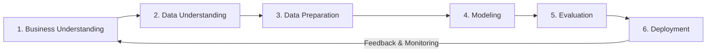

# CMPE 255 Assignment 1 Part 1 — CRISP-DM Implementation Plan

## 1. Executive Summary & Research Question
This document formalizes the data mining and predictive modeling architecture for CMPE 255 Assignment 1 Part 1.
- **Central Question**: *“How strong is home-field advantage in European soccer, and how accurately can match results be predicted using information available before kickoff?”*
- **Target**: Multiclass outcome \(Y \in \{H, D, A\}\) (Home Win, Draw, Away Win).
- **Core Hypothesis**: While betting markets provide strong probability sharpness, integrating leakage-safe chronological rolling form enables balanced recognition across all three outcome classes, specifically recovering draw recall and lifting Macro-F1.

---

## 2. CRISP-DM Methodology & Architecture

### Phase 1: Business Understanding
- **Objective**: Measure European home advantage across 11 leagues and 8 seasons; evaluate whether pre-kickoff historical form adds predictive signal over bookmaker market odds.
- **Key Metrics**:
  - **Macro-F1**: Primary model selection metric ensuring equal weighting between classes (\(H, D, A\)).
  - **Accuracy**: Overall fraction of correct outcome picks.
  - **Log Loss & Brier Score**: Multi-class probability calibration metrics.
  - **Expected Calibration Error (ECE)**: Deviation between predicted probabilities and observed empirical event frequencies.

### Phase 2: Data Understanding & EDA
- **Dataset**: Kaggle European Soccer Database (`database.sqlite`), 25,979 matches.
- **Findings**:
  - Global Outcome Distribution: Home Wins = **45.87%**, Draws = **25.39%**, Away Wins = **28.74%**.
  - Goal Advantage: Host teams average **1.54** goals/game vs **1.16** for visitors (+**0.381** goal differential).
  - Temporal Stability: Home win percentage remains tightly bounded between 44.1% and 46.8% across all 8 seasons.

### Phase 3: Data Preparation & Leakage Protection
- **Strict Chronological Ordering**: Fixtures sorted strictly by `(date, id)`.
- **Zero Same-Day Leakage Protocol**: Matches scheduled on the same date are evaluated in batch before any internal team history dictionaries are updated.
- **Feature Set**:
  - Rolling 5-match points, win rate, goals for, goals against, and goal differential.
  - Venue-specific form (home games for home team, away games for away team).
  - Rest days clamped between 1 and 30.
  - Normalized implied market probabilities: \(P_i = \frac{1/O_i}{\sum (1/O_j)}\).
- **Temporal Partitions**:
  - **Training**: 2008/09 – 2013/14 (19,328 matches, 16,783 with Bet365 odds).
  - **Validation / Confirmation**: 2014/15 (3,325 matches, 2,904 with Bet365 odds).
  - **Test (Untouched)**: 2015/16 (3,326 matches, 2,905 with Bet365 odds).

### Phase 4: Modeling
1. **Majority Baseline**: Constant prediction of 'H' with empirical class priors.
2. **Betting Market Baseline**: Normalized Bet365 implied probabilities.
3. **Form-Only Logistic Regression & GBDT**: Trained purely on historical rolling form and rest features.
4. **Odds-Enhanced Logistic Regression & GBDT**: Trained on rolling form + normalized Bet365 market probabilities.

### Phase 5: Evaluation & Statistical Inference
- **Locked Test Results (2015/16 Test Season, N = 2,905 matched odds fixtures)**:

| Model Architecture | Macro-F1 | Accuracy | Draw Recall | Log Loss | Brier Score | ECE |
|---|---:|---:|---:|---:|---:|---:|
| **Odds-Enhanced Logistic Regression (Selected)** | **0.4770** | 49.05% | **24.62%** | 1.0028 | 0.5990 | 0.0278 |
| Odds-Enhanced Gradient Boosting | 0.4580 | 48.98% | 19.34% | 1.0142 | 0.6045 | 0.0315 |
| Betting Market Baseline (Normalized Odds) | 0.3807 | **52.39%** | 0.41% | **0.9781** | — | — |
| Form-Only Logistic Regression | 0.4285 | 46.16% | 14.50% | 1.0421 | 0.6231 | 0.0384 |
| Majority Baseline | 0.2048 | 44.34% | 0.00% | 1.1398 | 0.6480 | 0.0139 |

- **Macro-F1 Lift**: **+0.0963** vs Betting Market.
- **95% Date-Clustered Bootstrap CI**: **[0.0792, 0.1135]** (\(p < 0.05\)).

### Phase 6: Full-Stack Deployment
- **Backend (`/server`)**: Python FastAPI high-performance REST API.
- **Frontend (`/client`)**: React 18, Vite, Tailwind CSS, Lucide, and Recharts interactive dashboard.
- **Unified Launcher (`run_demo.sh`)**: Single-script deployment spinning up backend and frontend concurrently.
