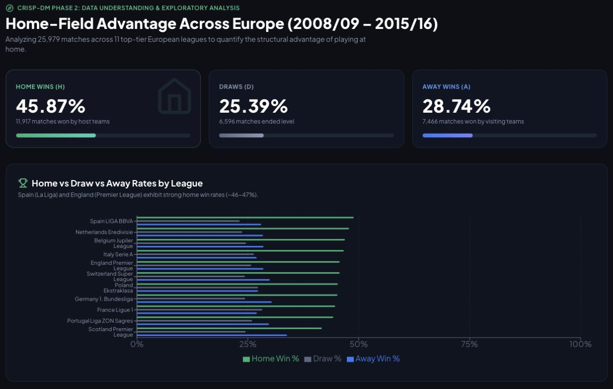
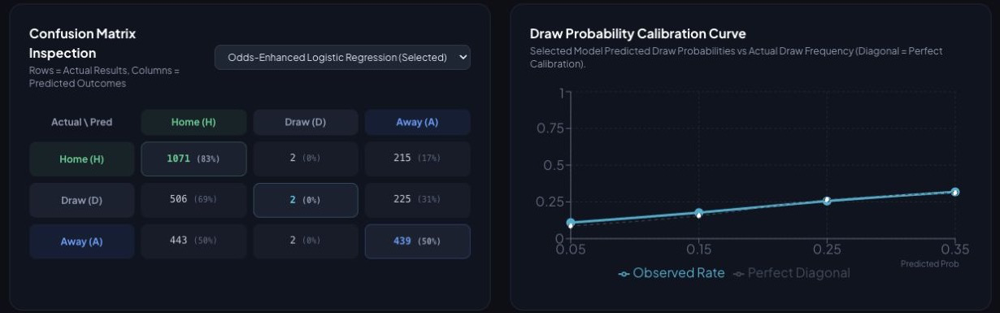
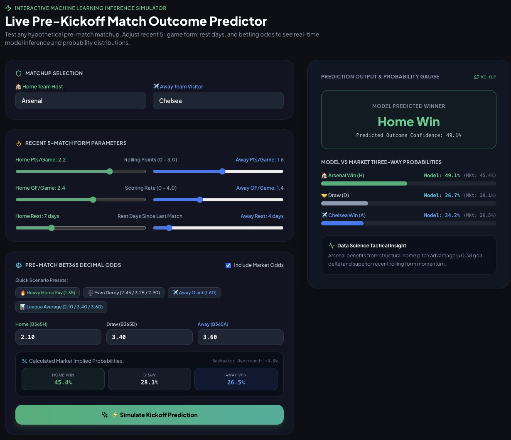

# What 25,979 Soccer Matches Taught Me About Home Advantage and Prediction

*A walkthrough of the data, the models, and the app—and why checking the results changed the story.*

Playing at home seems like an advantage. Predicting what happens in a particular match is a different problem.

For my CMPE 255 data mining assignment, I explored both using the European Soccer Database: 25,979 matches from 11 European leagues over eight seasons, from 2008/09 through 2015/16. I wanted to measure the home advantage, then test whether recent team form could improve predictions beyond a baseline built from betting odds.

The result was an end-to-end project: a data pipeline, six prediction methods, and a FastAPI/React application for exploring the findings and trying hypothetical matchups. The clearest finding was home advantage. The evidence for beating the odds baseline was much weaker than the original write-up suggested.

## Start with two questions

I organized the project around CRISP-DM, short for Cross-Industry Standard Process for Data Mining. Its six stages are business understanding, data understanding, data preparation, modeling, evaluation, and deployment.

For this project, that meant moving from “What are we trying to learn?” to “What data can we use?”, then building features, comparing models, checking results, and making them understandable in an app.

The two questions were:

1. How does home advantage vary across leagues and seasons?
2. Can information available before kickoff predict a home win, draw, or away win?

The second question is a three-class classification task. The model predicts **H, D, or A**, not the exact score. The final score tells us the correct label afterward; it cannot be an input for predicting that same match.

## First, what does the data show?

Exploratory data analysis, or EDA, means examining the data before interpreting a model: checking what is present, summarizing distributions, and looking for patterns that deserve closer attention.

Across the full dataset, home teams won **45.87%** of matches, away teams won **28.74%**, and **25.39%** ended in draws. Home teams scored an average of **1.545 goals**, compared with **1.161** for visitors—a difference of **+0.384 goals per match**.

*The home-win share exceeds the away-win share across the leagues shown. The cards summarize all 25,979 matches; the bars let us examine individual competitions.*

The EDA also compares seasons, goal distributions, and team-level performance. Home teams scored more on average in every season, although the size of the advantage changed. The saved season summaries put home win rates between **43.87% and 47.43%**.

These are descriptive findings. They do not prove that the crowd, travel, or familiarity with the pitch caused the entire difference. Team strength and other factors can contribute. And because the dashboard summarizes all eight seasons, including the test season, I treat these charts as retrospective EDA rather than claiming they were all restricted to training data.

## Build features as if the match has not happened yet

The central preparation rule was simple: a match's inputs must come from information available before it.

The pipeline sorts matches chronologically and builds each team's recent history. From up to five previous matches, it calculates points per game, win rate, goals scored and conceded, and goal difference. It adds venue-specific form, the amount of available history, rest days, and differences between the home and away teams.

For example, if the home side has averaged 2.2 points per game and the visitor 1.6, their recent-points difference is +0.6. That is a compact way to compare form. Venue-specific history separately asks how the host has performed at home and the visitor away.

This is where **data leakage** matters. If a feature includes the result we are trying to predict—or a later result—the model gets information it would not have had before kickoff.

To avoid a subtler version of that problem, the pipeline processes matches in date-sized batches. It creates features for every match on a date before adding any of that date's results to team histories. Only then does it move to the next date. Earlier results can inform later fixtures, but results never travel backward through the feature history.

Missing-history cases use defaults. The model pipelines also use median imputation for missing inputs, and logistic regression standardizes features so differences in measurement scale do not dominate its fitting process.

## Turn betting odds into a useful benchmark

The market baseline uses Bet365 decimal odds for home, draw, and away outcomes. Taking the reciprocal of each odd gives an implied probability, but the three values usually add up to more than 100%. That excess is the bookmaker's overround.

The pipeline divides each reciprocal by their total so the probabilities sum to one. With odds of **2.10, 3.40, and 3.60**, for example, the normalized probabilities are approximately **45.4% home, 28.1% draw, and 26.5% away**.

The baseline then picks the largest probability. In this example it predicts a home win, even though a draw still has a substantial probability. That distinction explains how a method can assign sensible probability to draws while rarely choosing “draw” as its final label.

## Compare models on the same matches

The chronological partitions are training through **2013/14**, a **2014/15** validation partition, and **2015/16** for final evaluation. Of the 3,326 final-season matches, **2,905 have complete Bet365 odds**. All six methods are compared on those same fixtures. The implemented runner also restricts training to complete-odds rows, including for form-only models.

The methods progress from simple to more flexible:

- **Majority baseline:** always choose home win.
- **Normalized odds:** choose the market's most probable outcome.
- **Form-only logistic regression and gradient boosting:** learn from historical team statistics.
- **Odds-enhanced logistic regression and gradient boosting:** combine form with normalized market probabilities.

Logistic regression learns how features relate to class probabilities. Gradient boosting combines trees to capture more flexible relationships. Comparing both helps test whether additional model complexity is useful.

One qualification matters: the current runner creates the validation partition but does not use it for tuning or model selection. It fits fixed configurations and labels odds-enhanced logistic regression “Selected.” That is different from demonstrating that a validation search chose the best model.

## Accuracy alone hides the draw problem

Accuracy asks how often the predicted label is correct. **Recall for draws** asks how many actual draws the model catches. **Precision for draws** asks how often its draw predictions are right. F1 combines precision and recall; **macro-F1** averages the F1 scores for home wins, draws, and away wins equally.

That equal weighting was the reason for choosing macro-F1 as the project's main comparison metric. It makes a neglected class visible. Choosing the metric does not, by itself, make the trained models recognize draws.

Here are the label-based results in the current saved metrics, rounded for readability. Each line shows **accuracy / macro-F1 / draw recall**:

- Majority baseline: **44.34% / 0.2048 / 0.00%**.
- Normalized odds: **52.01% / 0.3799 / 0.00%**.
- Form-only logistic regression: **49.19% / 0.3590 / 0.00%**.
- Form-only gradient boosting: **49.19% / 0.3611 / 0.55%**.
- Odds-enhanced logistic regression: **52.05% / 0.3836 / 0.27%**.
- Odds-enhanced gradient boosting: **52.01% / 0.3858 / 0.55%**.

The combined models are close to the market baseline. Gradient boosting has the highest recorded macro-F1, but draw recognition remains very low throughout.

*Read the confusion matrix by row: of 733 actual draws, only two were classified as draws. The curve beside it evaluates draw probabilities, which is a different question from choosing a draw as the final outcome.*

The original article claimed macro-F1 of 0.4770 and draw recall of 24.62%. Those values do not match the current saved artifacts. Checking the output changed the conclusion: this run has not solved the draw problem.

## Is the small improvement convincing?

The selected logistic model's recorded macro-F1 lift over normalized odds is **+0.0037**. The pipeline estimates its uncertainty with 1,000 date-clustered bootstrap repetitions: it resamples match dates, keeping fixtures from each sampled date together, and recalculates the difference.

The resulting **95% interval is −0.0007 to +0.0083**. Because it includes zero, this comparison does not establish a statistically significant improvement. A positive headline number is not enough to claim the model reliably beats the benchmark.

Probability quality needs its own checks. Log loss penalizes assigning low probability to what actually happened; Brier score measures squared probability error; calibration compares predicted probabilities with observed frequencies. A group of matches given roughly 30% draw probability should draw about 30% of the time if that estimate is calibrated.

There is also an implementation issue in the current exports: learned classifiers return probability columns in their own class order, while parts of evaluation and fixture export assume H/D/A order without aligning them. This can swap home and away probability labels and affect calibration, Brier scores, and coefficient interpretation. Log loss also needs a consistent ordering convention. The draw column remains in the middle, but that does not validate the full probability report.

For that reason, I report the class-label metrics above and avoid using the exported probability scores to declare a winner. The live prediction endpoint separately maps probabilities using the model's class labels.

## Make the analysis something people can explore

The application has a FastAPI backend and a React, TypeScript, Vite, and Tailwind frontend. Its overview and CRISP-DM walkthrough explain the project; the EDA and model views expose the analysis. A Match Explorer lets users filter saved 2015/16 fixtures by league, team, outcome, and prediction correctness.

The Live Predictor adds a different interaction: change the form statistics, rest days, and odds for a hypothetical matchup, then run the saved logistic model on those inputs.

*A hypothetical scenario, not a forecast for a scheduled Arsenal–Chelsea match. The controls supply the statistics; team names label the example rather than fetching current team information.*

This makes the feature ideas tangible. Adjusting an input lets someone see how the model responds, but it does not show that changing rest or form would cause a particular real-world result. The simulator also uses defaults for some inputs, so it is an educational interface rather than a live forecasting service.

The repository includes the training and evaluation modules, saved models and JSON results, tests for chronological features, temporal splits, and API behavior, plus a single-command launcher: `./run_demo.sh`.

## What I would carry into the next iteration

AI assistance helped organize the CRISP-DM plan, implement the pipeline and application, and prepare tests and presentation materials. The useful lesson from reviewing those outputs was to compare the written claims with the executable workflow and saved evidence. A polished explanation can still describe a result the current code does not produce.

The next steps are concrete: align probability columns consistently, use the validation season for actual model selection, reconcile the dashboard's stale claims with its data, and evaluate future revisions on fresh held-out seasons. Richer inputs such as player information or expected goals would come after that foundation is reliable.

The data ends in 2016, odds are incomplete, and these comparisons cover one final season. Home advantage is clear in this historical sample; a dependable predictive improvement over the odds baseline is not. Learning to tell those two findings apart was an important part of the assignment.

---

**Explore the project:** [GitHub repository](https://github.com/isaackimmi/cmpe-255-assignment-1-pt-1-iteration-3). **Dataset:** [European Soccer Database by Hugo Mathien on Kaggle](https://www.kaggle.com/datasets/hugomathien/soccer).

*Figures are screenshots captured from the Iteration 3 app. Numerical results were checked against the local `artifacts/metrics.json` and `artifacts/eda_summary.json` on September 12, 2026; this article does not represent a new training run. The project is a historical educational analysis, not betting advice.*
