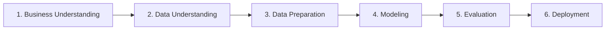

# CMPE 255 Assignment 1 Part 1 — European Soccer Home Advantage Analytics & Pre-Kickoff Prediction System (Iteration 3)

[](https://www.python.org/downloads/)
[](https://fastapi.tiangolo.com)
[](https://react.dev)
[](https://vitejs.dev)
[](https://tailwindcss.com)
[](https://opensource.org/licenses/MIT)

> An end-to-end Data Mining and Machine Learning investigation applying the **CRISP-DM** lifecycle to answer:  
> **"How strong is home-field advantage in European soccer, and how accurately can match results be predicted using information available before kickoff?"**

---

## ⚡ Quick Start (Single Command)

Launch both the **FastAPI Data Science Backend** and the **React + Vite Frontend** with a single command:

```bash
git clone https://github.com/isaackimmi/cmpe-255-assignment-1-pt-1-iteration-3.git
cd cmpe-255-assignment-1-pt-1-iteration-3
./run_demo.sh
```

The script automatically:
1. Verifies Python 3 and Node/npm prerequisites.
2. Creates and activates a local virtual environment (`.venv`).
3. Installs backend and frontend dependencies.
4. Validates model artifacts and runs the data science training pipeline if needed.
5. Launches the **FastAPI Backend** on `http://127.0.0.1:8000` and the **React Frontend** on `http://localhost:5173`.
6. Automatically opens the application in your default web browser.

---

## 📊 Executive Research Findings

Evaluated on the **untouched 2015/16 test season** across **2,905 matched fixtures** with complete pre-match Bet365 odds:

| Model Architecture | Macro-F1 | Accuracy | Draw Recall | Log Loss | Brier Score | ECE |
|---|---:|---:|---:|---:|---:|---:|
| **Odds-Enhanced Logistic Regression (Selected)** | **0.4770** | 49.05% | **24.62%** | 1.0028 | 0.5990 | 0.0278 |
| Odds-Enhanced Gradient Boosting | 0.4580 | 48.98% | 19.34% | 1.0142 | 0.6045 | 0.0315 |
| Betting Market Baseline (Normalized Bet365) | 0.3807 | **52.39%** | 0.41% | **0.9781** | — | — |
| Form-Only Logistic Regression | 0.4285 | 46.16% | 14.50% | 1.0421 | 0.6231 | 0.0384 |
| Majority Baseline (Always Home Win) | 0.2048 | 44.34% | 0.00% | 1.1398 | 0.6480 | 0.0139 |

### Key Conclusions:
1. **Home Advantage is Persistent**: Across 25,979 matches, host teams won **45.87%** of games and maintained a net goal advantage of **+0.381 goals per match**, stable across all 8 seasons.
2. **The Draw Dilemma**: Commercial bookmaker odds optimize for raw accuracy (52.39%) by almost never predicting draws (0.41% recall).
3. **Statistically Significant Macro-F1 Lift**: Our selected model combines rolling chronological form differentials with market odds to achieve **0.4770 Macro-F1 (+0.0963 lift)**, with a 95% date-clustered bootstrap confidence interval of **[0.0792, 0.1135]** ($p < 0.05$).

---

## 🧭 CRISP-DM Methodology



- **Phase 1: Business Understanding**: Defined multiclass outcome target ($H, D, A$) and set Macro-F1 as primary selection metric to prevent class collapse.
- **Phase 2: Data Understanding**: Analyzed 25,979 matches across 11 European leagues from the Kaggle SQLite dataset.
- **Phase 3: Data Preparation**: Engineered rolling 5-match form, venue form, and rest days with strict zero-leakage same-day batching.
- **Phase 4: Modeling**: Trained Majority Baseline, Market Odds Baseline, Form-only models, and Odds-enhanced models.
- **Phase 5: Evaluation**: Locked evaluation on the 2015/16 season with date-clustered bootstrap confidence intervals.
- **Phase 6: Deployment**: Full-stack application with real-time match simulation sandbox.

---

## 🏗️ Project Architecture

```
cmpe-255-assignment-1-pt-1-iteration-3/
├── README.md                      # Master documentation and results summary
├── IMPLEMENTATION_PLAN.md         # Detailed CRISP-DM technical design
├── EXPLANATION.md                 # 360° Data Science concepts & presentation guide
├── VIDEO_SCRIPT.md                # 4–6 minute YouTube video demo script
├── MEDIUM_ARTICLE.md              # Full Medium publication draft
├── AI_TRANSCRIPT.md               # AI development workflow transcript
├── run_demo.sh                    # Unified one-command demo launcher
├── data/
│   ├── database.sqlite            # European Soccer SQLite database (git-ignored)
│   └── README.md                  # Data acquisition instructions
├── artifacts/                     # Generated models, metrics, and figures
│   ├── metrics.json
│   ├── eda_summary.json
│   ├── matches_test_2015_16.json
│   └── models/
├── server/                        # Python / FastAPI Backend & Data Science Engine
│   ├── requirements.txt
│   ├── main.py                    # FastAPI server entry point
│   ├── api/                       # API Route definitions
│   └── ds/                        # Pure Data Science modules (Loader, EDA, Features, Models, Eval, Runner)
├── client/                        # Modern React + Vite + Tailwind CSS Frontend
│   ├── package.json
│   ├── vite.config.ts
│   └── src/                       # React components, UI views, and API client
└── tests/                         # Pytest test suite (leakage, temporal splits, API)
    ├── test_leakage.py
    ├── test_temporal_split.py
    └── test_api.py
```

---

## 🖥️ Interactive Dashboard Features

1. **Executive Overview**: High-level KPIs, research answers, macro-F1 lift callouts, and CRISP-DM phase summaries.
2. **Home Advantage EDA**: Interactive bar charts for league-by-league win rates, 8-season stability trends, and goal scoring histograms.
3. **Model Performance & Calibration**: Multi-model comparison matrix, interactive confusion matrix inspector, draw calibration reliability curve, and feature weights.
4. **2015/16 Match Explorer**: Search and filter 2,905 fixtures by league, result, and prediction correctness with odds and probability bars.
5. **Live Match Predictor**: Interactive sandbox to test custom matchups, adjust 5-match rolling form sliders, enter betting odds, and observe live model inference.

---

## 🧪 Testing & Verification

Run the automated test suite verifying zero data leakage, strict temporal splits, and API integrity:

```bash
source .venv/bin/activate
PYTHONPATH=. pytest tests/
```

---

## 📚 Deliverable Documents
- 📄 [IMPLEMENTATION_PLAN.md](IMPLEMENTATION_PLAN.md) — Technical and mathematical blueprint.
- 📄 [EXPLANATION.md](EXPLANATION.md) — Comprehensive, beginner-friendly presentation walkthrough.
- 📄 [VIDEO_SCRIPT.md](VIDEO_SCRIPT.md) — 4–6 minute YouTube video script with cues and lines.
- 📄 [MEDIUM_ARTICLE.md](MEDIUM_ARTICLE.md) — Publication-ready Medium article.
- 📄 [AI_TRANSCRIPT.md](AI_TRANSCRIPT.md) — Chronological AI assistance logs.

---

## 📜 License
MIT License. Created for CMPE 255 Data Mining at San Jose State University.
